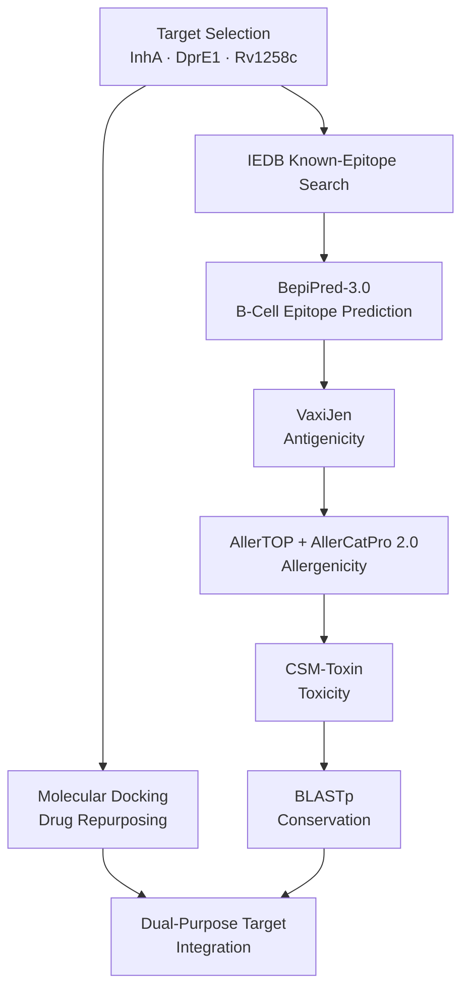

<p align="center">

</p>

# TB-DualTarget: Integrated Computational Pipeline for Drug Repurposing and B-Cell Vaccine Epitope Prediction in *Mycobacterium tuberculosis*

### Dual-Purpose Target Discovery via Molecular Docking, Immunoinformatics, and Cross-Database Validation

<p align="center">


</p>

<br>

*An in silico research project integrating molecular docking-based drug repurposing with B-cell epitope prediction and multi-layer immunological screening to identify targets in _Mycobacterium tuberculosis_ that are simultaneously druggable and vaccine-relevant ("dual-purpose targets").*

---

# 📑 Table of Contents

- <a href="#project-overview">Project Overview</a>
- <a href="#targets-selected">Targets Selected</a>
- <a href="#repository-structure">Repository Structure</a>
- <a href="#pipeline-overview">Pipeline Overview</a>
- <a href="#part-1-drug-repurposing-molecular-docking">Part 1: Drug Repurposing — Molecular Docking</a>
- <a href="#part-2-iedb-known-epitope-search">Part 2: IEDB Known-Epitope Search</a>
- <a href="#A-b-cell-epitope-prediction-bepipred-30">A: B-Cell Epitope Prediction — BepiPred-3.0</a>
- <a href="#B-antigenicity-vaxijen">B: Antigenicity — VaxiJen</a>
- <a href="#C-allergenicity-allertop--allercatpro-20">C: Allergenicity — AllerTOP & AllerCatPro 2.0</a>
- <a href="#D-toxicity-csm-toxin">D: Toxicity — CSM-Toxin</a>
- <a href="#E-conservation-blastp">E: Conservation — BLASTp</a>
- <a href="#final-results">Final Results</a>
- <a href="#key-finding">Key Finding</a>
- <a href="#limitations">Limitations</a>
- <a href="#tools--databases">Tools & Databases</a>
- <a href="#future-work">Future Work</a>
- <a href="#references">References</a>
- <a href="#license">License</a>
- <a href="#author--contact">Author & Contact</a>

---

## <a id="project-overview"></a>📖 Project Overview

Tuberculosis remains a leading global infectious killer, with rising multidrug-resistant (MDR) strains threatening existing treatments. This project applies an integrated computational pipeline—molecular docking + immunoinformatics—to three M. tuberculosis proteins (**InhA, DprE1, and Rv1258c**) to test whether a target can be both druggable and immunogenic, making it a candidate for combined drug and vaccine development.

---

## <a id="targets-selected"></a>🎯 Targets Selected

| Target | UniProt ID | Function | Cofactor |
|---|---|---|---|
| InhA | P9WGR1 | Enoyl-ACP reductase (mycolic acid biosynthesis) | NADH |
| DprE1 | P9WJF1 | Decaprenylphosphoryl-β-D-ribose oxidase (cell wall biosynthesis) | FAD |
| Rv1258c | P9WJX9 | Multidrug efflux MFS transporter (Tap) | — |

---

## <a id="repository-structure"></a>📁 Repository Structure

```bash
tb-dual-target-pipeline/
├── Proteins/
├── Prepared_proteins/
├── Drugs/
├── Docking/
│   ├── InhA_docking/
│   ├── DprE1_docking/
│   └── Rv1258c_docking/
├── Epitope/
│   ├── InhA_protein/
│   ├── Rv1258c_protein/
│   └── Toxicity/
├── README.md
└── LICENSE
```

<details>
<summary>Click to expand full structure</summary>

```bash
tb-dual-target-pipeline/
│
├── Proteins/
│   ├── InhA.pdb
│   ├── InhA.fasta
│   ├── DprE1.pdb
│   ├── DprE1.fasta
│   ├── Rv1258c.pdb
│   └── Rv1258c.fasta
│
├── Prepared_proteins/
│   ├── InhA_prepared.pdb
│   ├── DprE1_prepared.pdb
│   └── Rv1258c_prepared.pdb
│
├── Drugs/
│   ├── Isoniazid.pdb
│   ├── Isoniazid.png
│   ├── Ethionamide.pdb
│   ├── Ethionamide.png
│   ├── Metformin.pdb
│   ├── Metformin.png
│   ├── Disulfiram.pdb
│   ├── Disulfiram.png
│   ├── Thioridazine.pdb
│   └── Thioridazine.png
│
├── Docking/
│   │
│   ├── InhA_docking/
│   │   ├── InhA_prepared.pdbqt
│   │   ├── InhA_NADH_with_isoniazid/
│   │   │   ├── InhA_isoniazid_docked.pdb
│   │   │   ├── isoniazid_InhA_out.pdbqt
│   │   │   ├── isoniazid_minimized.pdbqt
│   │   │   ├── Docking.png
│   │   │   ├── Result.png
│   │   │   ├── 2D_isoniazid.png
│   │   │   └── 3D_isoniazid.png
│   │   │
│   │   ├── InhA_NADH_with_ethionamide/
│   │   │   ├── InhA_ethionamide_docked.pdb
│   │   │   ├── ethionamide_InhA_out.pdbqt
│   │   │   ├── ethionamide_minimized.pdbqt
│   │   │   ├── Docking.png
│   │   │   ├── Result.png
│   │   │   ├── 2D_ethionamide.png
│   │   │   └── 3D_ethionamide.png
│   │   │
│   │   └── InhA_NADH_with_metformin/
│   │       ├── InhA_metformin_docked.pdb
│   │       ├── metformin_InhA_out.pdbqt
│   │       ├── metformin_minimized.pdbqt
│   │       ├── Docking.png
│   │       ├── Result.png
│   │       ├── 2D_metformin.png
│   │       └── 3D_metformin.png
│   │
│   ├── DprE1_docking/
│   │   ├── DprE1_prepared.pdbqt
│   │   ├── DprE1_FAD_with_metformin/
│   │   │   ├── DprE1_metformin_docked.pdb
│   │   │   ├── metformin_DprE1_out.pdbqt
│   │   │   ├── metformin_minimized.pdbqt
│   │   │   ├── Docking.png
│   │   │   ├── Result.png
│   │   │   ├── 2D_metformin.png
│   │   │   └── 3D_metformin.png
│   │   │
│   │   └── DprE1_FAD_with_disulfiram/
│   │       ├── DprE1_disulfiram_docked.pdb
│   │       ├── disulfiram_DprE1_out.pdbqt
│   │       ├── disulfiram_minimized.pdbqt
│   │       ├── Docking.png
│   │       ├── Result.png
│   │       ├── 2D_disulfiram.png
│   │       └── 3D_disulfiram.png
│   │
│   └── Rv1258c_docking/
│       ├── Rv1258c_thioridazine_docked.pdb
│       ├── thioridazine_Rv1258c_out.pdbqt
│       ├── thioridazine_minimized.pdbqt
│       ├── Rv1258c_prepared.pdbqt
│       ├── Docking.png
│       ├── Result.png
│       ├── 2D_thioridazine.png
│       └── 3D_thioridazine.png
│
├── Epitope/
│   │
│   ├── InhA_protein/
│   │   ├── raw_output.csv
│   │   ├── epitope_score.fasta
│   │   ├── Result.png
│   │   │
│   │   └── Allergenicity/
│   │       ├── InhA_AllerCatPro2_QTGMGIN.csv
│   │       ├── Result_QTGMGIN.png
│   │       ├── InhA_AllerCatPro2_GGALGEE.csv
│   │       └── Result_GGALGEE.png
│   │
│   ├── Rv1258c_protein/
│   │   ├── raw_output.csv
│   │   ├── epitope_scores.fasta
│   │   ├── Result.png
│   │   │
│   │   └── Allergenicity/
│   │       ├── GKPHHTSRPQ_AllerCatPro2_prediction.csv
│   │       └── Result_GKPHHTSRPQ.png
│   │
│   └── Toxicity/
│       └── Results.csv
│
├── README.md
└── LICENSE
```

</details>

---

## <a id="pipeline-overview"></a>🔄 Pipeline Overview 



---

## <a id="part-1-drug-repurposing-molecular-docking"></a>💊 Part 1: Drug Repurposing — Molecular Docking

**Tool:** AutoDock Vina | **Validation:** Discovery Studio Visualizer (2D/3D), UCSF ChimeraX (H-bond/clash verification)

Isoniazid and ethionamide (known InhA inhibitors) were docked first as benchmarks to validate the protocol, before testing repurposing candidates (metformin, disulfiram, thioridazine).

| Drug | Target | Affinity (kcal/mol) | Key Interactions | Category |
|---|---|---|---|---|
| Isoniazid | InhA + NADH | −4.9 | 3 H-bonds (NADH, GLY96); Pi-Alkyl (MET199) | Benchmark |
| Ethionamide | InhA + NADH | −5.1 | H-bond (NADH); Pi-Sulfur, Alkyl (MET199, PHE149, TYR158, ALA198) | Benchmark |
| Metformin | InhA + NADH | −5.0 | 2 H-bonds (NADH); Charge–Charge | Repurposing |
| Metformin | DprE1 + FAD | −5.2 | H-bond (TYR314); Carbon-H-bond (FAD); clash (LYS134) | Repurposing |
| Disulfiram | DprE1 + FAD | −5.2 | Alkyl/Pi-Alkyl network (LEU363/317, FAD, HIS132, LYS134, VAL365) | Repurposing |
| Thioridazine | InhA + NADH | −7.5 | 0 H-bonds, 0 clashes (ChimeraX) | ❌ Excluded |
| Thioridazine | Rv1258c | −8.2 | Carbon-H-bond, Pi-Sigma, Pi-Alkyl (ALA48/110/113/114, ILE27, THR51, LEU55, TYR357) | ✅ **Flagship** |

**Interpretation:** Benchmark drugs anchored to NADH as expected, validating the protocol. Metformin bound both InhA and DprE1 with affinities comparable to the benchmarks, forming plausible cofactor-directed interactions — though its therapeutic relevance needs experimental validation given metformin's very different established pharmacology. Disulfiram's DprE1 result aligns with its documented role as a covalent DprE1 inhibitor, supporting DprE1's druggability. Thioridazine's InhA result was numerically strong but structurally unsupported (0 H-bonds) and excluded; its Rv1258c result was the study's strongest and most structurally coherent finding.

---

## <a id="part-2-iedb-known-epitope-search"></a>🗄️ Part 2: IEDB Known-Epitope Search

| Target | B-cell Epitopes | T-cell Epitopes | MHC Binders |
|---|---|---|---|
| InhA | 0 | 1 (RLPAKAPLL, ID 144947) | 1 (HLA-E) |
| DprE1 | 0 | 0 | 0 |
| Rv1258c | 0 | 0 | 0 |

**Interpretation:** InhA has one experimentally validated T-cell epitope (RLPAKAPLL, supported by 21 MHC ligand binding assays and 2 solved crystal structures) but no B-cell epitope data — motivating this project's B-cell prediction. DprE1 and Rv1258c have zero IEDB entries of any kind, confirming their predictions here are genuinely novel.

---

## <a id="A-b-cell-epitope-prediction-bepipred-30"></a>🧫 A: B-Cell Epitope Prediction — BepiPred-3.0

**Threshold:** 0.1512 (default) | **Score used:** raw `BepiPred-3.0 score` | **Rule:** strict consecutive residues ≥5 aa | **Verification:** cross-checked against official server FASTA — 0 mismatches (InhA 269/269, Rv1258c 419/419)

| Protein | Epitope | Position | Length | Avg Score |
|---|---|---|---|---|
| InhA | QTGMGIN | 100–106 | 7 | 0.1775 |
| InhA | GGALGEE | 204–210 | 7 | 0.2265 |
| DprE1 | — none — | — | — | — |
| Rv1258c | GKPHHTSRPQ | 197–206 | 10 | 0.2244 |
| Rv1258c | DIDRPVGS | 410–417 | 8 | 0.1770 |

**Interpretation:** InhA and Rv1258c each yielded surface-consistent linear epitope candidates. DprE1 produced no run reaching the 5-residue minimum, indicating no strong linear B-cell epitope under this method.

---

## <a id="B-antigenicity-vaxijen"></a>🧪 B: Antigenicity — VaxiJen

**Model:** Bacteria | **Threshold:** 0.5

| Protein | Epitope | Score | Verdict |
|---|---|---|---|
| InhA | QTGMGIN | 1.4227 | ✅ Antigen |
| InhA | GGALGEE | 0.9748 | ✅ Antigen |
| Rv1258c | GKPHHTSRPQ | 0.8944 | ✅ Antigen |
| Rv1258c | DIDRPVGS | −0.5358 | ❌ Non-antigen |

**Interpretation:** 3 of 4 candidates confirmed antigenic well above threshold; DIDRPVGS was excluded from further screening.

---

## <a id="C-allergenicity-allertop--allercatpro-20"></a>🌾 C: Allergenicity — AllerTOP & AllerCatPro 2.0

| Epitope | AllerTOP v2.0 | AllerCatPro 2.0 (E<0.001) | Final |
|---|---|---|---|
| QTGMGIN | Allergen | No evidence | Non-allergenic |
| GGALGEE | Non-allergen | No evidence | Non-allergenic |
| GKPHHTSRPQ | Allergen | No evidence | Non-allergenic |

**Interpretation:** AllerCatPro's stricter statistical threshold was prioritized over AllerTOP, since short-peptide hexamer matching (used by AllerTOP) is a documented source of false positives on 7–10 aa queries. All three candidates retained as non-allergenic.

---

## <a id="D-toxicity-csm-toxin"></a>☠️ D: Toxicity — CSM-Toxin

**Threshold:** 0.5

| Epitope | Score | Verdict |
|---|---|---|
| QTGMGIN | 0.46 | Non-toxic |
| GGALGEE | 0.19 | Non-toxic |
| GKPHHTSRPQ | 0.00 | Non-toxic |

**Interpretation:** All three candidates fall below threshold; GKPHHTSRPQ shows the highest-confidence non-toxic classification.

---

## <a id="E-conservation-blastp"></a>🌍 E: Conservation — BLASTp

| Epitope | Identity | E-value | Combined Members |
|---|---|---|---|
| QTGMGIN | 100% | 0.22–0.24 | 147 (InhA, incl. *M. avium*) |
| GGALGEE | 100% | 2.5–2.7 | ~103 (InhA) |
| GKPHHTSRPQ | 100% | 2×10⁻⁴ | 129 (Rv1258c, incl. BCG strain) |

**Interpretation:** All three candidates are 100% conserved across multiple *M. tuberculosis* isolates. GKPHHTSRPQ shows the strongest statistical signal and is conserved even in the BCG vaccine strain.

---

## <a id="final-results"></a>📊 Final Results

| Protein | Epitope | Antigenic | Non-Allergen | Non-Toxic | Conserved | Status |
|---|---|---|---|---|---|---|
| InhA | QTGMGIN | ✅ | ✅ | ✅ | ✅ | Retained |
| InhA | GGALGEE | ✅ | ✅ | ✅ | ✅ | Retained |
| Rv1258c | GKPHHTSRPQ | ✅ | ✅ | ✅ | ✅ | Retained |
| Rv1258c | DIDRPVGS | ❌ | — | — | — | Excluded |
| DprE1 | — | — | — | — | — | No candidate |

---

## <a id="key-finding"></a>🌟 Key Finding

**Rv1258c is this project's dual-purpose target:** strongest docking hit overall (thioridazine, −8.2 kcal/mol, structurally validated) **and** a conserved, antigenic, non-allergenic, non-toxic novel B-cell epitope (GKPHHTSRPQ) absent from IEDB — simultaneously druggable and vaccine-relevant.

---

## <a id="limitations"></a>⚠️ Limitations

- In silico predictions only; no experimental (wet-lab) validation performed
- Small sample size (3 proteins), appropriate for mini-project scope
- Docking scores alone are not proof of binding — demonstrated directly by the excluded Thioridazine–InhA result
- Metformin (InhA/DprE1) and disulfiram (DprE1) pairings are novel hypotheses, not literature-confirmed mechanisms

---

## <a id="tools--databases"></a>🛠️ Tools & Databases

AutoDock Vina · Discovery Studio Visualizer · UCSF ChimeraX · IEDB · BepiPred-3.0 · VaxiJen v2.0 · AllerTOP v2.0 · AllerCatPro 2.0 · CSM-Toxin · NCBI BLASTp · UniProt

---

## <a id="future-work"></a>🚀 Future Work

- Experimental validation of thioridazine–Rv1258c binding (efflux inhibition assays)
- Experimental testing of predicted epitopes (ELISA)
- Extension to additional targets (MmpL3, QcrB, GyrB)
- Conformational epitope prediction for DprE1

---

## <a id="references"></a>📚 References

1. Clifford, J.N., Høie, M.H., Deleuran, S., Peters, B., Nielsen, M. and Marcatili, P., 2022. BepiPred‐3.0: Improved B‐cell epitope prediction using protein language models. Protein Science, 31(12), p.e4497.
2. Doytchinova, I.A. and Flower, D.R., 2007. VaxiJen: a server for prediction of protective antigens, tumour antigens and subunit vaccines. BMC bioinformatics, 8(1), p.4.
3. Dimitrov, I., Bangov, I., Flower, D.R. and Doytchinova, I., 2014. AllerTOP v. 2—a server for in silico prediction of allergens. Journal of molecular modeling, 20(6), p.2278.
4. Nguyen, M.N., Krutz, N.L., Limviphuvadh, V., Lopata, A.L., Gerberick, G.F. and Maurer-Stroh, S., 2022. AllerCatPro 2.0: a web server for predicting protein allergenicity potential. Nucleic acids research, 50(W1), pp.W36-W43.
5. Trott, O. and Olson, A.J., 2010. AutoDock Vina: improving the speed and accuracy of docking with a new scoring function, efficient optimization, and multithreading. Journal of computational chemistry, 31(2), pp.455-461.
6. Morozov, V., Rodrigues, C.H. and Ascher, D.B., 2023. CSM-toxin: a web-server for predicting protein toxicity. Pharmaceutics, 15(2), p.431.
7. Altschul, S.F., Madden, T.L., Schäffer, A.A., Zhang, J., Zhang, Z., Miller, W. and Lipman, D.J., 1997. Gapped BLAST and PSI-BLAST: a new generation of protein database search programs. Nucleic acids research, 25(17), pp.3389-3402.
8. Altschul, S.F., Gish, W., Miller, W., Myers, E.W. and Lipman, D.J., 1990. Basic local alignment search tool. Journal of molecular biology, 215(3), pp.403-410.
9. Meng, E.C., Goddard, T.D., Pettersen, E.F., Couch, G.S., Pearson, Z.J., Morris, J.H. and Ferrin, T.E., 2023. UCSF ChimeraX: Tools for structure building and analysis. Protein Science, 32(11), p.e4792.
10. Vita, R., Mahajan, S., Overton, J.A., Dhanda, S.K., Martini, S., Cantrell, J.R., Wheeler, D.K., Sette, A. and Peters, B., 2019. The immune epitope database (IEDB): 2018 update. Nucleic acids research, 47(D1), pp.D339-D343.
11. Ahmad, S., Jose da Costa Gonzales, L., Bowler-Barnett, E.H., Rice, D.L., Kim, M., Wijerathne, S., Luciani, A., Kandasaamy, S., Luo, J., Watkins, X. and Turner, E., 2025. The UniProt website API: facilitating programmatic access to protein knowledge. Nucleic acids research, 53(W1), pp.W547-W553.

---

## <a id="license"></a>📄 License

This project is licensed under the [MIT License](https://github.com/genome-miner/tb_dual_target_pipeline/blob/main/LICENSE).

---

## <a id="author--contact"></a>👨‍💻 Author & Contact

**Sana Aziz Sial**  
Biotechnologist and Bioinformatician
- 🎓 [University of Veterinary and Animal Sciences](https://www.uvas.edu.pk/)
- 📧 [Email](sanaazizsial@gmail.com)
- 🐙 [GitHub](https://github.com/genome-miner)
- 🔗 [LinkedIn](in/sana-aziz-sial-73b189265)


---

<div align="center">

## ⭐ Support the Project

_If you found this repository useful, consider giving it a **star** on GitHub._

_Thank you for visiting!_
</div>

<p align="center">

</p>

